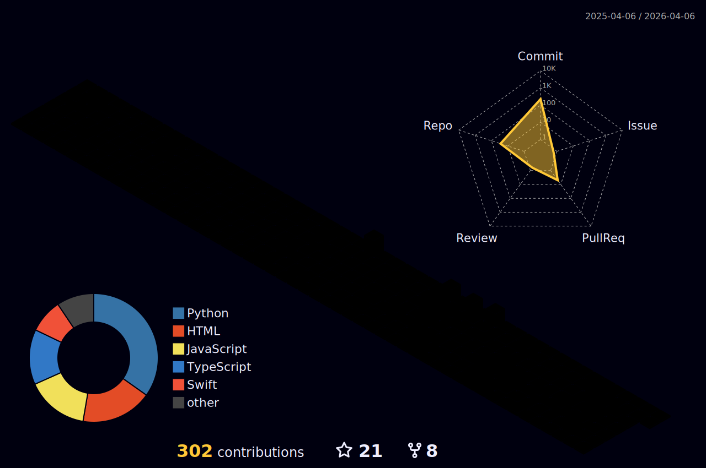

  

---

### 👨‍💻 About Me

  <blockquote>
    "Data is the new oil, but AI is the engine."
  </blockquote>
   

  I am a **Masters in Computer Science** student at **Rutgers University (2025-2027)** and a passionate AI Engineer. My journey involves building large-scale deep learning pipelines, optimizing extensive datasets, and creating intuitive user experiences.
  
  - 🔭 I’m currently working on **Generative AI for Biodiversity** and **Bio-Informatics**.
  - 🌱 I’m currently learning **Advanced Computer Vision** and **System Design**.
  - 💼 Previously: **AI Intern** at *Foundation for Ecological Security* & *Arcascope*.
  - ⚡ Fun fact: I once managed a **710GB** image dataset of 1,150 bird species!

---

### 🛠️ Tech Stack

  

---

### 💼 Work Experience

#### **Foundation for Ecological Security** | *Artificial Intelligence Intern*
*Jan 2025 - May 2025*
- 🦅 **AI Bird Classification**: Built a system for IBIS 2.0 handling a **710GB** dataset (1,150 species).
- 📈 **Performance**: Achieved **79% accuracy** using a two-stage deep learning pipeline.
- 🚀 **Deployment**: Deployed via Gradio for researchers.

#### **Arcascope** | *Artificial Intelligence Intern*
*Oct 2024 - Jan 2025*
- 💤 **Fatigue Prediction**: Developed a 20-version ML pipeline for fatigue prediction.
- 🏆 **Impact**: Reduced Mean Absolute Error (MAE) by **78%** (1.17 → 0.25) using a custom PyTorch model with CORAL layers.

---

### 🚀 Key Projects

<table>
  <tr>
    <td width="50%">
      <h3 align="center">🎵 Emotion-Driven Spotify Clone</h3>
      <ul>
        <li><strong>Tech</strong>: CNN, Python, Spotify API</li>
        <li><strong>Highlight</strong>: Facial emotion recognition with <strong>95.83% accuracy</strong> to recommend mood-based music.</li>
        <li><strong>Impact</strong>: Boosted simulated user engagement by 25%.</li>
      </ul>
    </td>
    <td width="50%">
      <h3 align="center">📄 PDFhelper - Intelligent Doc Retrieval</h3>
      <ul>
        <li><strong>Tech</strong>: LLaMA 3.2, Qdrant, Hugging Face</li>
        <li><strong>Highlight</strong>: Semantic document retrieval system.</li>
        <li><strong>Impact</strong>: Improved retrieval efficiency by <strong>70%</strong>.</li>
      </ul>
    </td>
  </tr>
</table>

---

### 📜 Publications

- **Patel, V.**, Shah, K., & Joshi, K. (2025). _"Openpose, posenet and movenet: The evolution of deep learning methods in yoga pose and classification."_ (**ICDAM-2025**, London).
- **Patel, V.** (2024). _"Machine learning-based hand gesture recognition for immersive gaming."_
- **Patel, V.**, & Mehta, K. (2024). _"Emotion-aware music recommendations: Evaluating custom CNN vs. VGG16 and inception V3."_ (**IEEE FMLDS**).

---

### 📊 GitHub Stats

  
  

  

<!-- 3D Contribution Graph Placeholder - Automated by GitHub Action -->

  

---

  

  <h3>📫 Connect with Me</h3>
  
  
  

