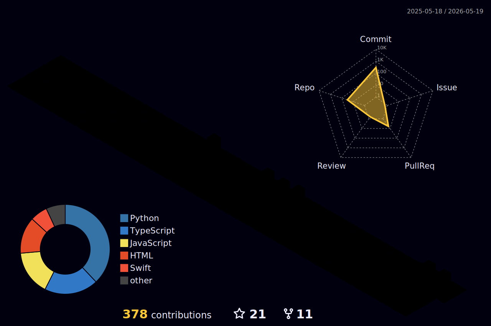

<div align="center">
  
</div>

<div align="center">
  
  
  
</div>

## Hey, I'm Varesh

I like building systems that are easier to trust because they are easier to debug.

Most of my work sits somewhere between applied ML and systems engineering: edge demos on QEMU, researcher-facing ML tools, repeatable pipelines, and test harnesses that catch problems before people do. I care about logs, profiling, instrumentation, weird failure modes, and making models behave like real software.

- Currently at Rutgers University pursuing an **M.S. in Computer Science**.
- Previously worked on **bird-species classification at scale** and **fatigue prediction from wearable data**.
- Right now I am pushing harder into **edge AI**, **verification-minded tooling**, and **reliable ML workflows**.
- Outside core engineering work, I am also an **Adobe Student Ambassador**, running workshops and creating technical content on campus.

---

## Build Log

```text
varesh@github:~$ whoami
MS CS student @ Rutgers

varesh@github:~$ focus --now
edge ai | ml tooling | validation-heavy systems

varesh@github:~$ latest_debug_win
fixed an inference-thread stack overflow on an ARM Cortex-M demo running in QEMU

varesh@github:~$ what_i_optimize_for
instrument first
make failures visible
keep experiments reproducible
ship things other people can actually use
```

---

## Languages and Tools

<div align="center">
  <a href="https://skillicons.dev">
    
  </a>
</div>

<div align="center">
  <sub>Also worked with QEMU, Zephyr, TensorFlow Lite Micro, Qdrant, Hugging Face, GitHub Actions, CMSIS-NN, and structured log-based debugging workflows.</sub>
</div>

---

## Signature Builds

### [Zypher EdgeAI Demo](https://github.com/Haadesx/Zypher-EdgeAI-Demo)
**Zephyr + QEMU + TensorFlow Lite Micro + CMSIS-NN**

This is the project that feels most like the direction I want to keep pushing.

- Built an ARM Cortex-M edge AI demo with RTOS threading, UART JSON output, runtime diagnostics, latency profiling, and stack monitoring.
- Used QEMU to make embedded debugging less painful and more repeatable.
- Tracked down and fixed an inference-thread stack overflow by actually measuring stack behavior instead of guessing.

### CI + Verification Harness
**GitHub Actions + Python + QEMU**

I do not like green checkmarks that tell you nothing. This work was about making failures readable.

- Added smoke-test validation so firmware builds had to produce expected structured output.
- Built log-driven assertions and deterministic checks instead of relying on "it compiled, so probably fine."
- Kept the workflow usable both in CI and in local development.

### PDFhelper
**Angular + .NET + Qdrant + Hugging Face**

This one is less embedded, but it shows the same pattern: build the system, then make it inspectable.

- Turned document retrieval into a full-stack workflow with semantic search, evaluation, and visibility into quality and latency.
- Improved retrieval efficiency by **70%** on internal benchmarking.
- Focused on chunking, observability, and traceable changes rather than hiding the pipeline behind a single demo screen.

---

## Experience

### Adobe | Student Ambassador
*September 2025 - Present*

- Create technical and creative content around Adobe Express and run workshops for the Rutgers student community.
- Useful side effect: it keeps me good at translating technical work for real people.

### Foundation for Ecological Security | Artificial Intelligence Intern
*January 2025 - May 2025*

- Built a classification workflow for a **710GB** bird dataset covering **1,150 species**, with dataset ingest, validation, and repeatable experiment runs.
- Delivered a researcher-facing CLI/GUI flow so the model could actually be used, not just trained.
- Spent a lot of time on noisy labels, confusing classes, and the practical side of making results inspectable.

### Arcascope | Artificial Intelligence Intern
*October 2024 - January 2025*

- Iterated a fatigue prediction pipeline through **20 versions**, tightening preprocessing and evaluation on noisy wearable data.
- Reduced MAE by **78%** from **1.17 to 0.25** using a PyTorch ordinal model with CORAL-style learning.
- Treated the work like engineering, not leaderboard chasing: compare changes, track regressions, and document what actually moved the metric.

---

## How I Like To Build

- Shipping demos that are usable by someone other than the person who built them.
- Instrumentation before guesswork.
- Clean experiment flow over chaotic trial-and-error.
- Projects where software reliability matters as much as model accuracy.
- Tooling that makes debugging faster the second time, not just the first time.

---

## Publications

- **Patel, V.**, Shah, K., & Joshi, K. (2025). *OpenPose, PoseNet and MoveNet: The evolution of deep learning methods in yoga pose classification.* **ICDAM 2025**, London.
- **Patel, V.** (2024). *Machine learning-based hand gesture recognition for immersive gaming.*
- **Patel, V.**, & Mehta, K. (2024). *Emotion-aware music recommendations: Evaluating custom CNN vs. VGG16 and Inception V3.* **IEEE FMLDS**.

---

## GitHub Pulse

<div align="center">
  
</div>

<div align="center">
  
  
</div>

<div align="center">
  
</div>

---

## Reach Out

<div align="center">
  <a href="mailto:workmailvaresh@gmail.com">
    
  </a>
  <a href="https://www.linkedin.com/in/vareshpatel">
    
  </a>
  <a href="https://x.com/varesh_patel">
    
  </a>
</div>

<div align="center">
  <br />
  If you are hiring for internships in edge AI, ML systems, embedded tooling, or reliability-focused software engineering, I would be glad to connect.
</div>
